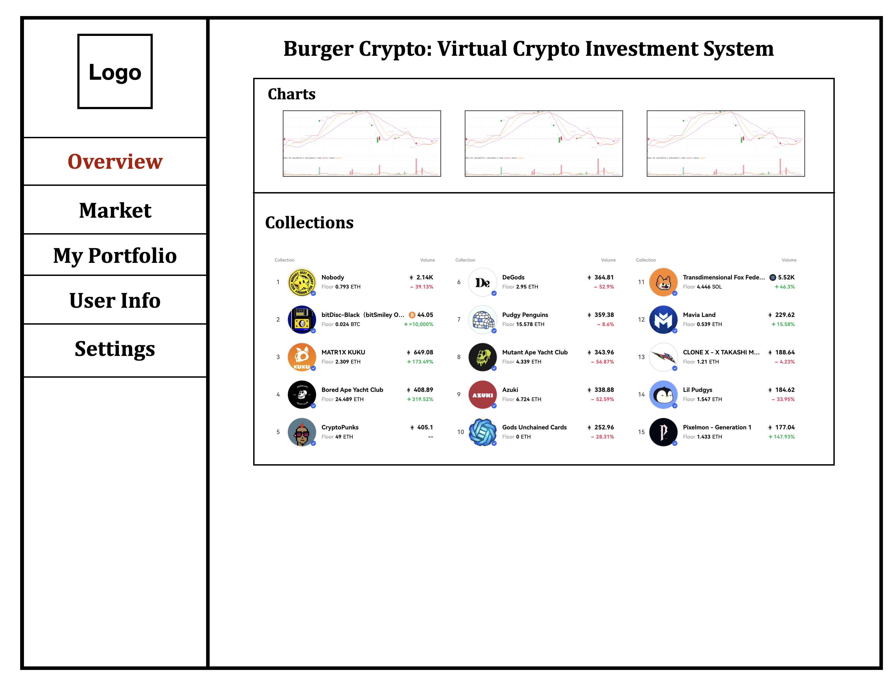
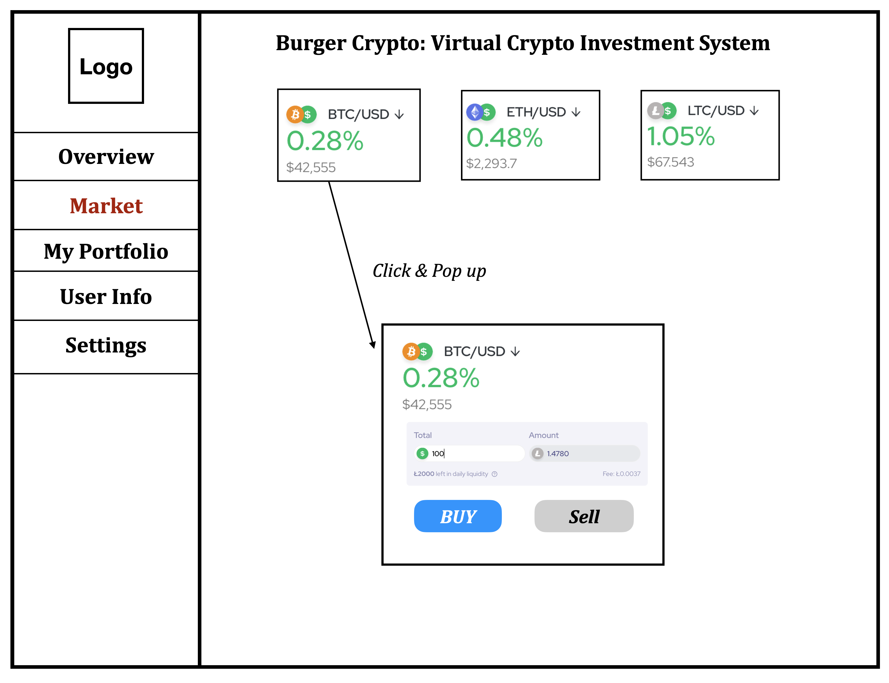

# Burger Crypto: Project Proposal

1. **Project Title**

   Burger Crypto (A Online virtual crypto investment system)

2. **Project Summary**
   The Virtual Crypto Investment System is a web-based application designed to simulate cryptocurrency investments without financial risk. This project aims to provide users with a platform to practice and understand crypto trading dynamics, market analysis, and portfolio management in a controlled, virtual environment. By utilizing real-time and historical cryptocurrency data, users can experiment with investment strategies, track their virtual portfolio's performance, and gain insights into market trends. This project will challenge our DBMS skills through the efficient handling of large datasets, real-time data processing, and complex query execution to provide a responsive and insightful user experience.

3. **Description of the Application**
   - **Problem Statement**: Despite the growing interest in cryptocurrency investments, many potential investors lack the knowledge or experience to navigate the volatile crypto market confidently. 
   - **Objective**: To create a risk-free, educational platform that leverages real-world data to simulate cryptocurrency investment scenarios, helping users to learn trading strategies, understand market trends, and manage virtual portfolios effectively.

4. **Creative Component**

   - **Comprehensive Educational Framework:** At the core of Burger Crypto is a structured educational framework that guides users from basic concepts of cryptocurrency to advanced investment strategies. This framework includes interactive tutorials, scenario-based learning exercises, and feedback mechanisms to ensure users not only engage in trading but also understand the rationale behind their decisions and market movements.
   - **Real-Time Data for Educational Simulations:** Although real-time market data is commonly used for trading simulations, Burger Crypto employs it uniquely by integrating it into educational scenarios. Users are prompted to make investment decisions based on current market conditions, followed by immediate feedback and analysis. This live-action learning helps users understand market dynamics in real-time, a feature that is often overlooked in traditional educational settings.
   - **AI-Driven Personalized Learning Paths:** While some platforms provide personalized experiences in the form of trading recommendations, Burger Crypto leverages AI to create personalized learning paths. These paths adapt to the user's learning pace, interests, and performance in simulations, offering tailored content, challenges, and quizzes. This ensures that each user's educational journey is optimized for their specific learning goals and styles.
   - **In-Depth Analytics for Learning Reflection:** Beyond providing performance metrics for portfolios, Burger Crypto offers analytical tools that encourage reflection and learning. Users can review their trading decisions, the system's AI-generated suggestions, and actual market outcomes to identify areas for improvement. This reflective process is supported by detailed explanations and resources, bridging the gap between theory and practice.

5. **Usefulness**
   - **Educational Simulator:** This application serves as an educational tool for aspiring crypto investors, offering features like real-time trading simulation, portfolio management and strategy recommendations. Unlike existing platforms like [Robinhood](https://robinhood.com/), [CryptoParrot](https://cryptoparrot.com/), our system focuses on education and practice, equipped with a recommendation engine for personalized learning experiences. This uniqueness lies in its educational value, real-time data integration, and personalized user engagement.
   
   - **Personalized Learning Paths:** Leveraging AI, Burger Crypto offers personalized learning experiences by analyzing users' interactions, trading behaviors, and educational progress. Based on this analysis, the platform suggests customized learning paths and content, ensuring that users receive relevant and timely information to address their specific learning needs and gaps. This personalized approach enhances the learning experience, making it more effective and engaging.
   
   - **Creative Reward Mechanism:** Implement a rewards mechanism within Burger Crypto that tracks user contributions, such as sharing investment strategies, participating in community discussions, and contributing educational content. Users earning "Burger Coins" can then redeem them for real burgers, merging the virtual achievements with tangible rewards. (e.g., users earn 1 Burger Coin for every thumbs-up received on their posts, and they can redeem 1,000 Burger Coins for a free burger at a local restaurant)

6. **Realness and Data Sources**
   We will use real-time and historical cryptocurrency data from APIs such as [CoinGecko](https://www.coingecko.com/en/api), [CoinCap](https://docs.coincap.io/#intro) and [CryptoCompare](https://min-api.cryptocompare.com/). These sources offer JSON data formats, including price, volume, market cap, and historical trade data. By integrating multiple datasets, we ensure the application reflects current market conditions and provides a realistic trading simulation.

7. **Functionality Description**
   Users can create, manage, and track virtual portfolios, simulate trades, view real-time market data, and receive personalized strategy recommendations. The application will support user authentication, portfolio creation/updation/deletion, and complex queries for data analytics, such as calculating the portfolio's performance over time.

   - **Low-Fidelity UI Mockup**
     A sketch will depict the dashboard with real-time cryptocurrency data, a portfolio management section, trading simulation interface, and personalized recommendation alerts. The UI will be designed for ease of navigation and user engagement.

     

     

   - **Project Work Distribution**
     The project will be divided into tasks such as frontend development, backend/database management, data integration (APIs), AI recommendation engine development, and testing.
     The backend and database management tasks will involve:

     - integrating external data sources (@yh63, @bohanw5)

     - designing the database schema (@yuanzez2, @ziyang8)

     - implementing data storage and retrieval mechanisms 
       - User module (@bohanw5, @yh63)
       - Trade module (@yuanzez2, @ziyang8)

     - ensuring data consistency and security (@bohanw5, @yh63, @yuanzez2, @ziyang8)

## Changes of Proposal

In response to the feedback received, we have meticulously updated our Burger Crypto project proposal to enhance its clarity, depth, and specificity. 

We've enriched the creative component by offering a deeper insight into our AI-driven investment advice algorithms and the operational mechanics of the Burger Coin rewards system, including concrete examples of user engagement and reward redemption processes. 

The educational value of our platform has been further highlighted through detailed descriptions of curated educational pathways and interactive learning tools, emphasizing our commitment to providing a comprehensive learning experience. 

<!-- 
We've also clarified the application of CRUD and search functionalities across the system, particularly in portfolio management and educational content interaction, ensuring a robust and user-friendly platform. Furthermore, we've addressed the necessity of update and delete operations in data analysis, providing scenario-based examples to illustrate their importance in maintaining data accuracy and integrity.  -->

This revised proposal reflects our dedication to delivering a high-quality, educational, and engaging virtual cryptocurrency investment platform, underscoring the innovative features and functionalities that set Burger Crypto apart.

### Possible Entities and Attributes (Examples)
- **User:** This entity stores information about users of the platform, including login credentials, profile details (such as name, email, and preferences), and activity history. Attributes might include UserID, Username, Password, Email, and DateJoined.

- **Portfolio:** Represents the collection of virtual investments held by a user. It could include details about the cryptocurrencies in the portfolio, the quantity of each, and the historical performance. Attributes might include PortfolioID, UserID (foreign key to User), AssetID (foreign key to Cryptocurrency), Quantity, and Value.

- **Cryptocurrency:** Stores information about the various cryptocurrencies available for trading and simulation on the platform. Attributes might include AssetID, Name, Symbol, CurrentPrice, MarketCap, and HistoricalData.

- **Trade:** Records the details of buy/sell transactions made by users within their virtual portfolios. Attributes might include TradeID, PortfolioID (foreign key to Portfolio), AssetID (foreign key to Cryptocurrency), TradeType (buy or sell), Quantity, TradePrice, and TradeDate.

- **Educational Content:** Contains educational materials provided to users. It might include articles, videos, tutorials, and quizzes. Attributes could include ContentID, Title, Description, ContentType (article, video, etc.), and ContentURL.

- **Burger Wallet:** Manages the rewards system currency, tracking the accrual and redemption of Burger Coins. Attributes might include RewardID, UserID (foreign key to User), CoinsEarned, CoinsSpent, and CurrentBalance.

